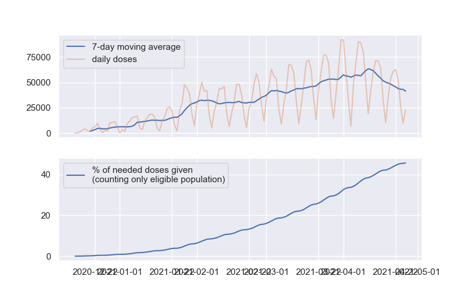

# Trax

Naive tracking of Wisconsin's vaccination progress.

I am not an expert, there's probably many reasons why the statistics I report here are incorrect.

Raw data was obtained from https://www.dhs.wisconsin.gov/covid-19/vaccine-data.htm (see [download.sh](./download.sh) for details).

# Current estimates

```
$ python trax.py
28538 average doses per day over past 7 days (-456 compared to 2 weeks ago)
52.4 weeks (2022-02-21) for EVERY PERSON to get 2 doses
40.7 weeks (2021-12-02) for all eligible people (over 16 years old) to get 2 doses
```

# Charts

Current vaccination progress.



---

Current vaccination progress extrapolated out to 100% completion (of people who are eligible for the vaccine) using the a rolling 7 day average. Dashed lines are the extrapolations.


# Why?

Tons of news sites, and even official government sites, only share the current progress. They do not estimate when the vaccinations will be completed if the current vaccination rates continue. I got tired of doing the calculation by hand, so I wrote a simple script to do it for me.
