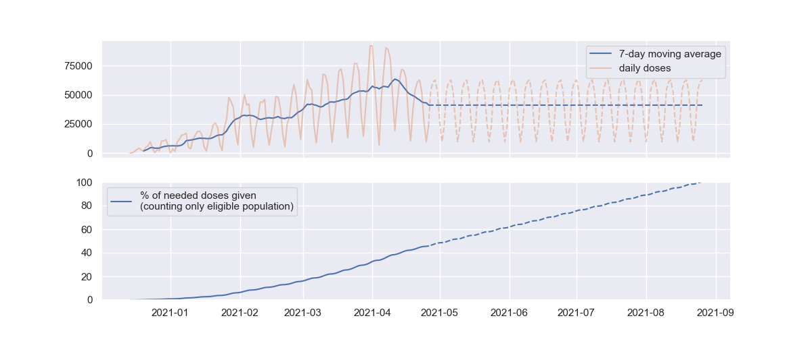

# Trax

Naive tracking of Wisconsin's vaccination progress.

I am not an expert, there's probably many reasons why the statistics I report here are incorrect.

Raw data was obtained from https://www.dhs.wisconsin.gov/covid-19/vaccine-data.htm. See below for instructions.

# Current estimates

```
$ python trax.py
28853 average doses per day over past 7 days (-327 compared to 2 weeks ago)
51.5 weeks (2022-02-18) for EVERY PERSON to get 2 doses
40.0 weeks (2021-11-29) for all eligible people (over 16 years old) to get 2 doses
```

# Charts

Current vaccination progress.


---

Current vaccination progress extrapolated out to 100% completion (of people who are eligible for the vaccine) using the a rolling 7 day average. Dashed lines are the extrapolations.



# Update data

1. Go to https://www.dhs.wisconsin.gov/covid-19/vaccine-data.htm
2. Under "Vaccine Distribution Summary" section, click "Download"
3. Hit "cross tab"
4. Hover over each option until you see the one called "Vax Summary - adm spk", check it
5. Select CSV for the format
6. Click Download
7. Click Download again, or copy the download link into a `curl` command. Either way, save it to the `vax.csv` file

# Why?

Tons of news sites, and even official government sites, only share the current progress. They do not estimate when the vaccinations will be completed if the current vaccination rates continue. I got tired of doing the calculation by hand, so I wrote a simple script to do it for me.
